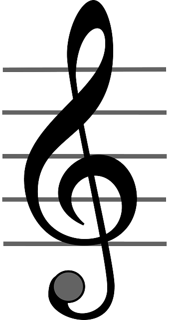

#  Sound tuner
This skill plays a sound in the given note or an sound in the given guitar string.

## About
This skill plays a sound in the given note or an sound in the given guitar string.
This can be used to tune a musical instruments.

Mycroft is using the even tempered (aka equal tempered) scale, where an octave is a
frequency ratio of exactly two and a semitone is a frequency ratio of exactly the
twelfth root of two. In the real world however many different temperaments may be
used - see en.wikipedia.org/wiki/Musical_temperament - and octaves too can vary in
size, see  en.wikipedia.org/wiki/Stretched_octave.

Also Mycroft call middle C for "C4" : this is the commonest octave numbering but some
people call middle C for "C3" or even for "C5".

## Examples
 - "Gime me an C note"
 - "Give me an guitar Low E string"
 - "Give me an A4 note"
 - "Give me an guitar A string"

## Credits
Andreas Lorensen (@andlo)

## Supported Devices
platform_mark1 platform_mark2 platform_picroft platform_plasmoid

## Category
**Information**

## Tags
#sound
#tuner
